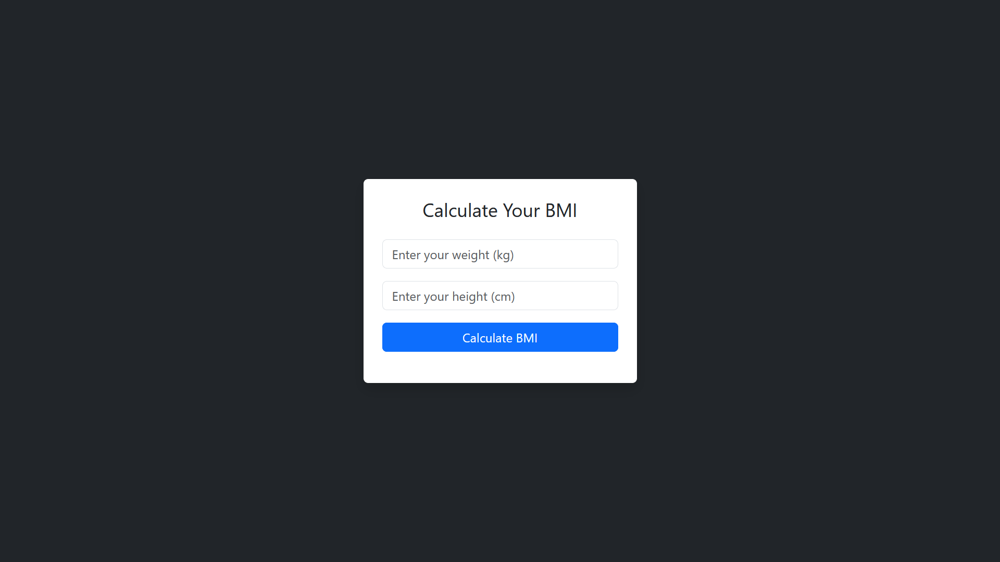

# BMI Calculator

A simple and responsive web app to calculate Body Mass Index (BMI) based on user input (weight and height).

---

## 🛠️ Built With

- HTML  
- CSS (Bootstrap 5)  
- JavaScript  

---

## 🌐 Features

- Supports both Arabic and English outputs simultaneously  
- Mobile responsive layout  
- Instant BMI calculation with category result  

---

## 📷 Preview

---

## 📖 How It Works

1. Enter your weight in kilograms.  
2. Enter your height in centimeters.  
3. Click "Calculate BMI".  
4. The result will show your BMI and health category in both Arabic and English simultaneously.

---

**Made with ❤️ by Hajar Al-Anazi**

---

# حاسبة مؤشر كتلة الجسم (BMI Calculator)

تطبيق ويب بسيط ومتجاوب لحساب مؤشر كتلة الجسم بناءً على وزن وطول المستخدم.

---

## 🛠️ التقنيات المستخدمة

- HTML  
- CSS (Bootstrap 5)  
- JavaScript  

---

## 🌐 المميزات

- يدعم عرض النتيجة باللغتين العربية والإنجليزية معًا  
- تصميم متجاوب يناسب الهواتف المحمولة  
- حساب فوري لمؤشر كتلة الجسم مع تصنيف الحالة الصحية  

---

## 📷 معاينة

---

## 📖 طريقة الاستخدام

1. أدخل وزنك بالكيلوغرام  
2. أدخل طولك بالسنتيمتر  
3. اضغط على زر "احسب مؤشر كتلة الجسم"  
4. ستظهر النتيجة مع تصنيف الحالة الصحية باللغتين العربية والإنجليزية معًا.

---

**تم التصميم والتطوير من قبل  
هاجر العنزي ❤️**

